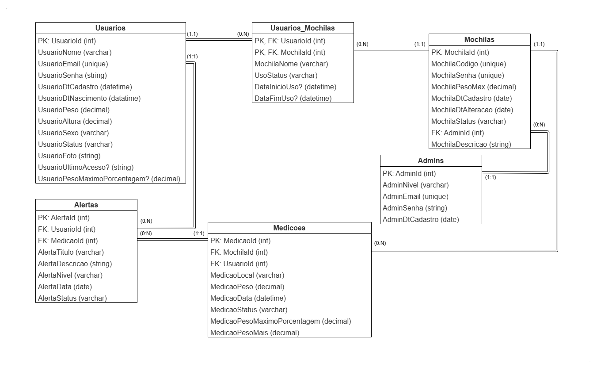
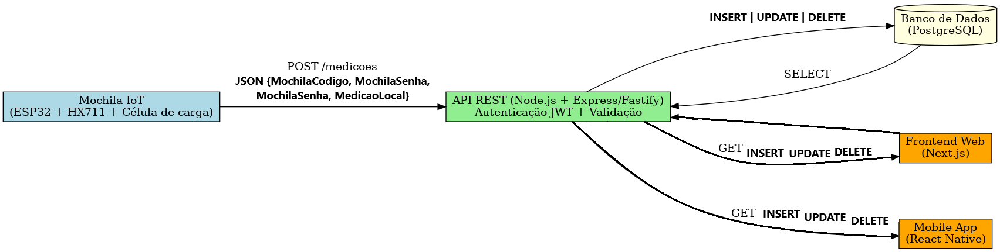

# DSM-G06-PI4-2025-2
Repositório do GRUPO 06 do Projeto Interdisciplinar do 4º semestre DSM 2025/2. Alunos: Cláudio de Melo Júnior, João Vitor Nicolau e Luís Pedro Dutra Carrocini.

---
<br>

# PI 4° Semestre - Mochila Inteligente (Uma Mochila que Cuida da sua Coluna)

Este projeto é o quarto PI (Projeto Interdisciplinar) do curso de DSM (Desenvolvimento de Software Multiplataforma) da Faculdade de Tecnologia Fatec Franca Dr. Thomaz Novelino. Seu objetivo é integrar os conhecimentos adquiridos nas principais disciplinas do quarto semestre: Laboratório de Desenvolvimento Web, Estatistica Aplicada, Internet das Coisas e Aplicações e Programação para Dispositivos Móveis I. O resultado é uma aplicação que integra Banco de Dados, API que realizará a comunicação e requisições com ele, um apliocativo móvel, um site e um protótipo de IOT.

<br>

## 📄 Descrição do Problema e Proposta

O projeto (Mochila Inteligente):

Muitos de nós carregam mochilas pesadas todos os dias, seja na escola, faculdade ou no trabalho. Quase sem perceber, adicionamos livros, cadernos, notebooks e outros itens que, juntos, se tornam uma carga excessiva. Essa rotina silenciosa pode ter consequências sérias. O excesso de peso não só causa desconforto imediato, mas também pode levar a dores crônicas, má postura e problemas de saúde a longo prazo.

A mochila oferece um monitoramento de peso em tempo real, fornecendo informações essenciais para que você possa cuidar da sua saúde e conforto, evitando os riscos associados ao transporte de peso excessivo.

Com a nossa Mochila Inteligente, você não precisa mais adivinhar se está carregando peso demais. A tecnologia faz o trabalho por você, lhe apresentando o peso transportado e gerando alertas quando esse limite é ultrapassado.

<br>

## 🛠️ Desenvolvimento

O BD foi desenvolvido com o SGBD PostGreSQL, que realiza a sua integração com a API através do Prisma, o que facilita o seu desenvolvimento e consultas. Foi escolhido pelos seguintes fatores:

- Ser relacional e flexivel: nessa aplicação não se faz necessário o uso de um BD não relacional, mas sim um relacional, que mantenha a integridade e consistência dos dados. Mas se necessário, ele possui suporte a colunas JSONB, que podem ser utilizadas para o armazenamento dos dados dos sensores).

- Índices avançados: (GIN, BRIN) que são úteis para consultas rápidas em milhões de registros de medições, caso a aplicação venha a suportar tamanha demanda.


A API foi desenvolvida com a estrutura Node.js (JavaScript). Devido aos seguintes fatores:

- Menor curva de aprendizagem: Front-End para a aplicação web será feito em Next , que se baseia em JavaScript. Bem como, o aplicativo mobile será desenvolvido em react native (também JavaScript). Mantendo assim a maior parte do projeto desenvolvida na mesma linguagem, diminuindo a curva de aprendizagem para o desenvolvimento e manutenção.

- Integração com o Prisma: Node.js possui suporte ao a tecnologia prisma, que facilita o desenvolvimento e integração com o Banco de Dados.

- Performance em I/O (entrada/saída): Node.js é assíncrono e event-driven, ele lida muito bem com múltiplas conexões simultâneas (vários usuários batendo na API ao mesmo tempo).

Funcionalidades:

- Login / Cadastro de Usuários

- Gerenciamento de mochilas pelos administradores do sistema

- Vínculo da mochila com o usuário

- Recebimento de medições capturados pela IoT

- Criação e encaminhamento de alertas, caso o limite do peso recomendável para o usuário ou mochila seja ultrapassado

- Geração de relatórios de peso carregado por usuário (diário, semanal, mensal, anual ou período escolhido)

Estrutura:

```
DSM-G06-PI4-2025-2/
├── API/
│   ├── prisma/
│   │   ├── migrations/
│   │   └── schema.prisma
│   └── src/
│       ├── controllers/
│       │   ├── alertas.js
│       │   ├── medicoes.js
│       │   ├── mochilas.js
│       │   ├── tokenJWT.js
│       │   ├── usuarios.js
│       │   └── usuariosMochilas.js
│       └── routes/
│           ├── alertas.js
│           ├── medicoes.js
│           ├── mochilas.js
│           ├── tokenJWT.js
│           ├── usuarios.js
│           └── usuariosMochilas.js
```


Para acessar e utilizar nossa API, é necessário um processo de autenticação via token JWT (JSON Web Token).

O token JWT é gerado no momento do login com e-mail e senha para os usuários e serve para garantir a segurança de todas as interações. Ele funciona como uma chave de acesso, permitindo que se consuma os endpoints da API de acordo com as suas permissões.

Cada token é único e especial, contendo as informações de acesso necessárias. Isso significa que, a cada requisição, a API verifica a validade e a autorização do seu token para liberar o acesso aos dados correspondentes.

A mochila, atuando como um cliente IoT, realiza um "login" inicial utilizando suas próprias credenciais: um código de identificação e uma senha.

Ao validar essas credenciais, a API gera um token JWT específico para a mochila. Esse token, então, é utilizado para que a mochila possa enviar os dados de peso e outras informações de forma segura para a API, garantindo que somente dispositivos autorizados possam se comunicar com o sistema.

Para aumentar a segurança e a usabilidade, nossa API utiliza um par de tokens: o Token de Acesso (Access Token) e o Token de Atualização (Refresh Token).

O Token de Acesso é a sua chave para interagir com a API. Ele é de curta duração e expira rapidamente (em 15 minutos). Isso é uma medida de segurança, pois, se for interceptado, o risco de uso indevido é limitado.

O Token de Atualização, por outro lado, tem uma vida útil mais longa (Mobile: 60 dias | Web: 1 dia). Ele não é usado para acessar a API diretamente. Sua única função é obter um novo Token de Acesso quando o antigo expirar, sem que o usuário precise fazer o login novamente. Isso garante uma experiência de uso contínua, mantendo a segurança.


O APP MOBILE foi desenvolvido utilizando React Native e Expo. Além de acelerar o processo de desenvolvimento, a utilização do Expo nos oferece ferramentas e bibliotecas prontas que facilitam a integração de recursos como a câmera, notificações e outras funcionalidades do dispositivo. Isso nos garante uma entrega mais rápida e eficiente, mantendo a qualidade e a performance em ambas as plataformas.

Estrutura:

```
DSM-G06-PI4-2025-2/
├── API/
│   ├── .expo/
│   ├── assets/
│   ├── node_modules/
│   └── src/
│       ├── assets/
│       ├── components/
│       │   ├── BottomNav.js
│       │   └── SettingsModal.js
│       ├── pages/
│       │   ├── annualReport.js
│       │   ├── backpack.js
│       │   ├── dailyReport.js
│       │   ├── deleteAccount.js
│       │   ├── futurePrediction.js
│       │   ├── home.js
│       │   ├── main.js
│       │   ├── monthlyReport.js
│       │   ├── profile.js
│       │   ├── reportingOptions.js
│       │   ├── reports.js
│       │   └── weeklyReport.js
│       ├── tasks/
│       ├── utils/
│       │   ├── backgroundTask.js
│       ├── routes.js
│       └── styles.js
```


O Site WEB foi desenvolvido o framework utilizado é o Next.js (um framework JavaScript), que torna fácil a integração com a API, que é  baseada em Node.js. 

Ele foi escolhido principalmente pela facilidade em criar rotas, componentes reutilizáveis, ter renderização flexível, fora já ser otimizado para fontes, scripts e imagens, além de tornar todo o software web escalável, em caso de expansão. 

Para alcançar nossos objetivos e melhorar a qualidade do programa web foram usadas algumas bibliotecas e dependências:

- Framer-motion (para gerar animações dinâmicas);

- Tailwind (framework de utilidades CSS);

- ESLint (usado para encontrar erros no código);

Estrutura:

```
DSM-G06-PI4-2025-2/
├── WEB/
│   ├── public/
│   └── src/
│       ├── app/
│       │   ├── alerts/
│       │   ├── backpack/
│       │   ├── home/
│       │        └── page.js
│       │   ├── hooks/
│       │   ├── login/
│       │   ├── profile/
│       │   ├── register/
│       │   ├── reports/
│       ├── global.css
│       ├── layout.js
│       ├── not-found.js
│       └── page.js
│       ├── components/
│       ├── jsconfig.json
│       ├── next.config.mjs
│       ├── package-lock.json
│       ├── package
│       ├── pnpm-lock.yaml
│       ├── postcss.config.mjs
│       └── .env
```


A IOT foi desenvolvida utilizando, no código, a linguadem de programação C++.

Para a sua mantagem, foram uzsados os seguintes componentes:

- 1 Power bank;

- 2 Células de Carga (medição do peso da mochila, uma para cada alça  da mochila);

- 2 Módulos HX711 (conversão do  sinal das células de carga para digital, comunicando com o ESP32);

- 1 ESP32-C3 (realizará comunicação com a API, conectado com o Wifi, enviando os medições captadas pelas células de carga, somente envia não recebe);

- 1 Mochila Simples

Circuito:
<br>


Se baseando na montagem e instruções do vídeo do canal [Brincando com Ideias](https://www.youtube.com/watch?v=-qLfybfvsHw)

<br>

### Diagrama Entidade Relacionamento (DER):


### Fluxo da comunicação entre as partes da aplicação:


<br>

## 📁 Documentação do Projeto
### 📒 [Documento Final](https://github.com/FatecFranca/DSM-G06-PI4-2025-2/raw/main/Documentacao_Final_Mochila_Inteligente_FATEC.docx?raw=1)

### 📙 [1° Apresentação](https://github.com/FatecFranca/DSM-G06-PI4-2025-2/raw/main/1-Apresentação-PI-4-Semestre.pptx?raw=1)

### 📕 [2° Apresentação](https://github.com/FatecFranca/DSM-G06-PI4-2025-2/raw/main/2-Apresentação-PI-4-Semestre.pptx?raw=1)

### 🎬 [Apresentação em Vídeio](https://youtu.be/Sbo_GT2PBmw)

<br>

## 📦 Aparência

### Web

Inicial


Login


Cadastrar-se


Home
<br>


Perfil
<br>


Relatórios


Diário


Semanal
<br>


Mensal
<br>


Anual


Previsão Futura


### Mobile

Login/Cadastrar-se


Home


Alterar Dados


Seleção de Mochilas


Relatórios


Relatório Diário


Relatório Semanal


Relatório Mensal


Relatório Anual


Previsão Futura


### IOT

Montagem


<br><br>

## 🛠️ Construído com

**Ferramentas:**
* Visual Studio Code - Editor de código-fonte
* Draw.io - Diagramas
* Canvas - Portfólio e diagramas
* Insomnia - Testes de API (Back-End)
* Figma - Protótipos da aplicação
* IA's (ChatGPT, Gemini, Deepseek e Qwen) - Consultas para crição de códigos diversos, correção de bugs e melhoria em performance


**Linguagens e Tecnologias:**
* HTML5 - Linguagem de marcação
* JavaScript - Lógica da aplicação
* CSS3 - Estilização
* PostGreSQL - Banco de dados
* Prisma ORM - Interface com o Banco de Dados
* Next.js - Web
* Node.js - API
* React-Native.js - Mobile

<br>

## ✒️ Autores

* **[Cláudio de Melo Júnior](https://github.com/Claudio-Fatec)** — Documentação do Projeto, Participação na Montagem IOT, Criação da Apresentação do Projeto, Suporte em atividades Paralelas ao Projeto;
* **[João Vitor Nicolau](https://github.com/Joao-Vitor-Nicolau-dos-Santos)** — Desenvolvimento do Site WEB, Participação na Montagem IOT, Design do Projeto;
* **[Luís Pedro Dutra Carrocini](https://github.com/luis-pedro-dutra-carrocini)** — Criação do Banco de Dados Relacional, Criação e Documentação da API, Criação do Aplicativo MOBILE, Desenvolvimento do Código IOT, Montagem do IOT, Participação na Criação da Apresentação do Projeto;

<br>

## 🎁 Agradecimentos

Agradecemos aos professores que nos acompanharam no curso, e durante esse semestre, transmitindo seus conehecimentos. Somos gratos especialmente aos das disciplinas fundamentais para este projeto:

* **[Prof. Alessandro Fukuta](https://github.com/alessandro-fukuta)** — Laboratório de Desenvolvimento Web
* **[Prof. Alexandre Gomes](https://github.com/xandygomes)** — Programação para Dispositivos Móveis I;
* **[Prof. Erick Nicolau](https://github.com/ericknicolau1)** — Internet das Coisas e Aplicações;
* **[Prof. Maria Luiza Cervi Uzun](https://www.youtube.com/@malucervi392)** — Estatística Aplicada;

---

Este site foi desenvolvido no início de nossa jornada acadêmica. Temos orgulho deste projeto por ser um dos nossos primeiros — e o primeiro com o envolvimento de IOT! Releve nosso "código de iniciante" 😊.  
Esperamos que seja útil para você em algum projeto! ❤️


