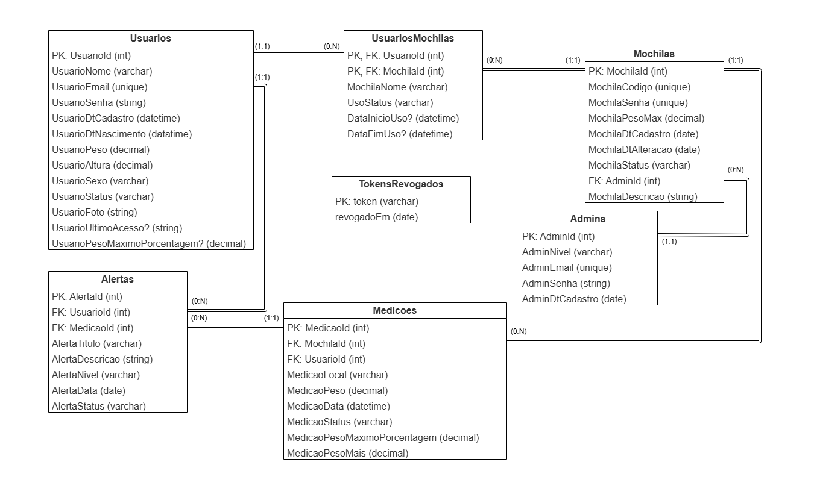

# DSM-G06-PI4-2025-2
Repositório do GRUPO 06 do Projeto Interdisciplinar do 4º semestre DSM 2025/2. Alunos: Cláudio de Melo Júnior, João Vitor Nicolau e Luís Pedro Dutra Carrocini.

---
 

# PI 4° Semestre - Mochila Inteligente (Uma Mochila que Cuida da sua Coluna)

Este projeto é o quarto PI (Projeto Interdisciplinar) do curso de DSM (Desenvolvimento de Software Multiplataforma) da Faculdade de Tecnologia Fatec Franca Dr. Thomaz Novelino. Seu objetivo é integrar os conhecimentos adquiridos nas principais disciplinas do quarto semestre: Laboratório de Desenvolvimento Web, Estatistica Aplicada, Internet das Coisas e Aplicações e Programação para Dispositivos Móveis I. O resultado é uma aplicação que integra Banco de Dados, API que realizará a comunicação e requisições com ele, um apliocativo móvel, um site e um protótipo de IOT.

O BD foi desenvolvido...
A APi foi desenvolvida...
O APP foi desenvolvido...
O site foi desenvolvido...
A IOT foi desenvolvida...

 

## 📄 Descrição

### Diagrama Entidade Relacionamento (DER):

### Fluxo da comunicação entre as partes da aplicação:

 

## 🏆 Protótipos
### 🥇 [Versão Final]()

 

## 📁 Documentação do Projeto
### 📒 [Documento Final]()

 

## 📦 Aparência

### Site

### Mobile

### IOT

  

## 🛠️ Construído com

**Ferramentas:**
* Visual Studio Code - Editor de código-fonte
* Draw.io - Diagramas
* Canvas - Portfólio e diagramas
* Insomnia - Testes de API (Back-End)
* Figma - Protótipos da aplicação
* IA's (ChatGPT e Gemini) - Consultas para crição de códigos diversos, correção de bugs e melhoria em performance

**Linguagens e Tecnologias:**
* HTML5 - Linguagem de marcação
* JavaScript - Lógica da aplicação
* CSS3 - Estilização
* PostGresSQL - Banco de dados
* Prisma ORM - Interface com o banco de dados

 

## ✒️ Autores

* **[Cláudio de Melo Júnior]()** — Partes;
* **[João Vitor Nicolau]()** — Desenvolvimento do Site;
* **[Luís Pedro Dutra Carrocini](https://github.com/luis-pedro-dutra-carrocini)** — Criação do Banco de Dados Relacional, Criação e Documentação da API, Criação do APP;

 

## 🎁 Agradecimentos

Agradecemos aos professores que nos acompanharam no curso, e durante esse semestre, transmitindo seus conehecimentos. Somos gratos especialmente aos das disciplinas fundamentais para este projeto:

* **[Prof. Alessandro Fukuta](https://github.com/alessandro-fukuta)** — Laboratório de Desenvolvimento Web
* **[Prof. Alexandre Gomes](https://github.com/xandygomes)** — Programação para Dispositivos Móveis I;
* **[Prof. Erick Nicolau](https://gist.github.com/faustocintra)** — Internet das Coisas e Aplicações;

---

Este site foi desenvolvido no início de nossa jornada acadêmica. Temos orgulho deste projeto por ser um dos nossos primeiros — e o primeiro com o envolvimento de IOT! Releve nosso "código de iniciante" 😊.  
Esperamos que seja útil para você em algum projeto! ❤️
